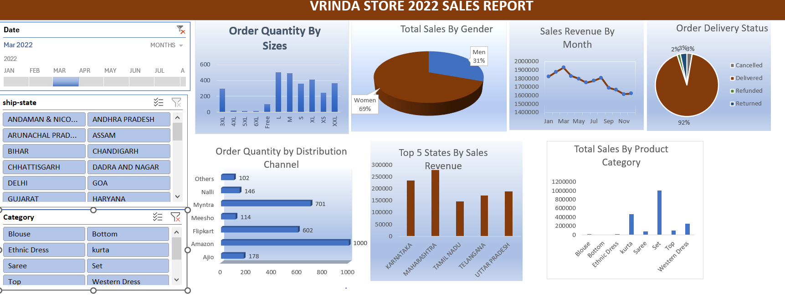
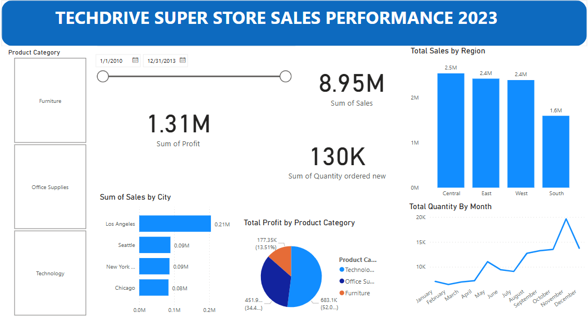

#Project 1

**Title:** [VRINDA STORE 2022 SALES REPORT](https://github.com/Vchi5/Vchi5.github.io/blob/main/Mydashboard.xlsx)

**Tools Used:** Microsoft Excel, Pivot Table, Slicers, Timelines

**Project Description:**

**Key findings:**

**Dashboard Overview:**

#Project 2

**Title:** Employee Record - SQL Data Manipulation and Interrogating

**SQL Code:** [Employee Record SQL Code](https://github.com/Vchi5/Vchi5.github.io/blob/main/Employee_Record.sql)

**SQL Skills Used:**
Data Retrieval (SELECT): Queried and extracted specific information from the database.
Data Aggregation (SUM, COUNT): Calculated totals, such as sales and quantities, and counted records to analyze data trends.
Data Filtering (WHERE, BETWEEN, IN, AND): Applied filters to select relevant data, including filtering by ranges and lists.
Data Source Specification (FROM): Specified the tables used as data sources for retrieval

**Project Description:**
 
**Technology used:** SQL server

#Project 3 

**Title:** [TECHDRIVE SUPER STORE SALES PERFORMANCE 2023](https://github.com/Vchi5/Vchi5.github.io/blob/main/PowerBiDashboardGithub.pbix)

**Tools Used:** PowerBi

**Project Description:**

**Key findings:**

**Dashboard Overview:**

